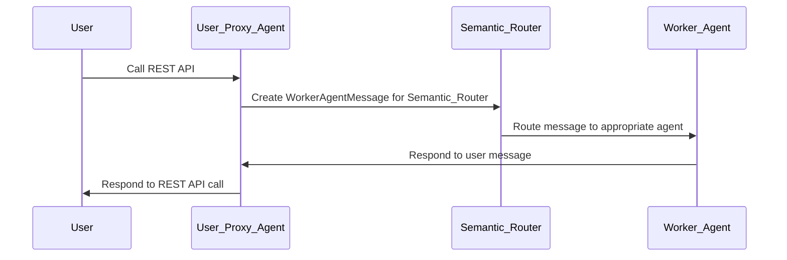

# Multi Agent Orchestration, Distributed Agent Runtime Example

## Description

This example is derived by the AutoGen
[semantic router](https://github.com/microsoft/autogen/tree/main/python/packages/autogen-core/samples/semantic_router) example.
The goal of this multiagent application is to get an user intent and a question,
try to find a possible candidate agent that can service the user query, respond to
the user query and finally return the reponse to the user.

The example is composed by 4 separate agentic applications:
 - The `proxy` agent: it implements the REST interface with the user, exposing an API
 that the user can call to POST an intent. The intent is then sent to the next agent, a
 `semantic_router`
 - The `semantic_router` agent: it gets the user intent and it tries to find a possible
 agent by querying an agent catalog. The catalog contains 2 classes of agents:
 the `HR` agent and the `Finance` agent.
 - The `HR` agent: it is specialized in responding to user queries in the `HR` domain.
 - The `Finance` agent: it is specialized in responding to user queries in the
 `Finance` domain.

The communication between the agentic apps is **PubSub** based and it is uses the
[host servicer](https://github.com/microsoft/autogen/blob/main/python/packages/autogen-core/src/autogen_core/application/_worker_runtime_host_servicer.py)
as message broker.
This is a simple python app that handles registration of agents and
subscriptions to topics (e.g. I am the HR agent class and I subscribe to the topic "hr").

Important things to notice:
 - Each agent runs in a single process and it has a precise goal
 (e.g. find the best agent for a task, respond to a query in a specific domain etc.)
 - An agent is not necessarily a single agent app, it can be a complex multiagentic application, and it can be potentially based on a different framework (e.g. LangGraph).
 - The host servicer runtime runs in a separate process and acts as message broker.
 - When an agent register against the host servicer runtime, it **does not register a
 specific instance**, but it provides a an **agent type and factory function** that the
 runtime will use to create an agent of that specific type.
 - In this example, subscriptions are not specific to a single agent, but they are rather
 specific to an **agent type**. E.g. the HR agent will subscribe to the HR topic and a
 new agent will be instantiated for each topic source.

## Run the app

### Set the `.env` variable

```
AZURE_OPENAI_API_KEY=XXX
AZURE_OPENAI_API_VERSION=2025-02-01-preview
AZURE_OPENAI_ENDPOINT=https://your-azure-openai-endpont
AZURE_OPENAI_DEPLOYMENT_NAME=gpt-4o-mini
```


### With docker compose

```
task compose
```

### With kind

```
task kind
```

## Under the hood

When launching the docker compose file or the k8s app, we run 4 runtime environments
and a host servicer. When the application starts, no actual agents are created, but
each runtime is instrumented with a factory method that it can use to create an agent
on the fly when needed.

Without any user interaction, no agents are created by default. Each runtime is configured
to be able to create some kind of agents, but the actual instantiation will happen only
upon the reception of a message for an agent subscription. For instance, an HR agent will be created only when another agent will send a message to the HR topic.

In addition, the framework support multitenancy: if we have 2 users in the system, we
don't want the same agent to serve both user, as it may reveal private information
of one user to the other one. This is achieve with the concept of "topic source": each
user will send a message to the "HR" topic with a different topic source, and this will
result in 2 different instances of the HR agent, each for each user.


### Message Flow

Using the "Topic" feature of the agent host runtime, the message flow of the system is as follows:


